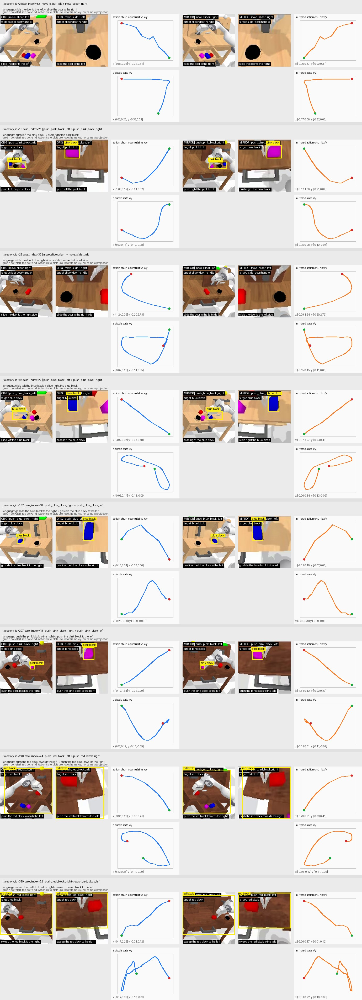

# WMH CALVIN AutoResearch

本目录记录 WMH 在 StarVLA / CALVIN ABC -> D 任务上的完整探索：训练只使用 CALVIN ABC，CALVIN D 只用于 closed-loop evaluation；不使用任何上游 action-trained checkpoints。这里同时包含代码改动、训练脚本、评测脚本、公开 checkpoint 评测入口、failure analysis 和 mirror augmentation 诊断材料。

更完整的路线论证见：

```text
examples/calvin_autoresearch/docs/calvin_abc_d_技术路线与failure分析报告_中文整理版.md
```

## 1. 总览

本次 WMH 分支的目标不是单纯把 baseline 训练更久，而是围绕 CALVIN D failure pattern 做有针对性的 data/model adaptation。

核心结论：

- 当前最可靠的 verified route 是 `hard-task balanced ABC training + controlled language paraphrase + task-aware image augmentation`。
- `hardv2 aug` 是目前 WMH 分支最强的已验证 checkpoint，D n300 达到 `avg_seq_len=1.847`、`SR@5=12.0%`。
- `left/right mirror augmentation` 已实现并做了可视化和 n300 评估。它明显强于 baseline，但略弱于 non-mirror hardv2，因此当前作为 diagnostic branch，而不是默认主路线。
- `LoRA2000` 明显优于 baseline，但单独使用仍弱于 hardv2 augmented data route。
- `MoE / adaptive action head` 有潜力，但必须检查 per-task regression，尤其是 drawer regression。GTY MoE95k 需要补 n300/n1000 公平评测。

## 2. 合规边界

本分支遵守以下边界：

- 训练数据只使用 CALVIN ABC。
- CALVIN D 只用于 closed-loop evaluation，不进入训练。
- 不使用 LIBERO、RoboTwin、RoboCasa、Behavior、CALVIN-D 等上游 action-trained checkpoints。
- 允许使用 base VLM checkpoint：`Qwen3-VL-4B-Instruct-Action`。
- 允许使用我们自己或组员在 CALVIN ABC 上训练得到的 checkpoints 作为 continuation source。

主要公共路径：

```text
project:
/inspire/qb-ilm2/project/26summer-camp-10/26220172/WMH/starVLA

public runtime:
/inspire/qb-ilm2/project/26summer-camp-10/public/seven/starvla_calvin

base model:
/inspire/qb-ilm2/project/26summer-camp-10/public/seven/starvla_calvin/shared/models/base/Qwen3-VL-4B-Instruct-Action

CALVIN ABC LeRobot:
/inspire/qb-ilm2/project/26summer-camp-10/public/seven/starvla_calvin/shared/datasets/calvin_lerobot

official CALVIN D eval data:
/inspire/qb-ilm2/project/26summer-camp-10/public/inspire_shared/calvin_d_d
```

## 3. 这次分支做了什么改动

### 3.1 训练数据和 dataloader

相关文件：

```text
starVLA/dataloader/__init__.py
starVLA/dataloader/gr00t_lerobot/datasets.py
starVLA/dataloader/lerobot_datasets.py
examples/calvin_autoresearch/train_files/data_registry/data_config.py
examples/calvin_autoresearch/train_files/*.yaml
```

主要改动：

- 增加 CALVIN ABC 专用 dataset mixture 和 data registry。
- 增加 hard-task balanced sampling，重点覆盖 `slider`、`drawer`、`light/LED`、`push_*_right` 等 D-critical hard tasks。
- 增加 canonical task mapping，避免不同 language template 导致 task identity 混乱。
- 增加 controlled language paraphrase，不改变 canonical task label。
- 增加 task-aware image augmentation，避免强 generic augmentation 破坏小 affordance。
- 增加 left/right mirror augmentation 的数据路径和配置开关。
- 接通 CALVIN state/proprio，支持 8-D state 输入和 state-aware eval。

### 3.2 模型和训练

相关文件：

```text
starVLA/model/framework/VLM4A/QwenGR00T.py
starVLA/training/train_starvla.py
starVLA/training/trainer_utils/trainer_tools.py
examples/calvin_autoresearch/train_files/moe_lora/qwen_gr00t_moe_lora.py
```

主要改动：

- 支持 QwenGR00T action head 的 CALVIN ABC-only training。
- 支持 connector/interface 训练，同时保持 Qwen backbone 主要冻结。
- 支持 Qwen LoRA exploration。
- 支持 MoE95k checkpoint + fresh LoRA continuation。
- 加强训练配置、save interval、public run path 和 H200 多卡 launcher。

### 3.3 Policy server 和 CALVIN eval

相关文件：

```text
deployment/model_server/policy_norm_processor.py
deployment/model_server/policy_wrapper.py
deployment/model_server/server_policy.py
deployment/model_server/tools/websocket_policy_client.py
examples/calvin/eval_files/eval_calvin.py
```

主要改动：

- 修复/增强 websocket policy server/client 在 CALVIN closed-loop eval 下的兼容性。
- 支持从 CALVIN evaluator 向 policy server 发送 state。
- 增加 normalization 和 action chunk 处理的稳定性。
- 增加更详细的 evaluation metrics，包括 conditional success、failure position、per-task success、near-miss、action magnitude、jitter、saturation 和 gripper switch rate。

### 3.4 WMH 一键入口和脚本

相关文件：

```text
wmh
train_nohup.sh
run_wmh_adaptive.sh
examples/calvin_autoresearch/scripts/
```

主要改动：

- 新增 `./wmh` 作为短命令入口，封装训练、评测、tail log、status、finalize 等常用操作。
- 新增 `train_nohup.sh`，用于在 H200 节点上后台启动 WMH 分支训练。
- 新增 public-only eval runner，让组员只用 `public/seven` 可达路径也能跑 WMH checkpoint 评测。
- 新增多 GPU / 多 worker 并行 D evaluation 和手动 finalize 工具。
- 新增 mirror preview、candidate transform diagnostics、metric summary 和 ABC-vs-D comparison 工具。

## 4. 主要结果

以下结果均为 CALVIN D closed-loop evaluation。

| Branch | N | Avg Seq Len | SR@1 | SR@2 | SR@3 | SR@4 | SR@5 | 结论 |
| --- | ---: | ---: | ---: | ---: | ---: | ---: | ---: | --- |
| `base8k` | 300 | 1.050 | 54.0% | 25.7% | 13.7% | 8.0% | 3.7% | reference baseline |
| `base8k` | 1000 | 1.086 | 53.2% | 27.9% | 15.2% | 8.0% | 4.3% | stable baseline |
| `lora2000` | 300 | 1.630 | 64.0% | 43.7% | 27.3% | 18.3% | 9.7% | LoRA 有效 |
| `aug_hardv2` | 300 | 1.847 | 72.0% | 51.0% | 29.3% | 20.3% | 12.0% | 当前 WMH 最强 verified branch |
| `mirror_hardv2` | 300 | 1.753 | 72.7% | 47.7% | 29.0% | 16.3% | 9.7% | mirror 有帮助，但略弱于 non-mirror |
| `moe_adaptive` | 300 | 1.397 | 67.7% | 38.0% | 19.0% | 10.3% | 4.7% | mixed result，有 task regression |
| `GTY MoE95k` | 100 | 1.910 | 76.0% | 54.0% | 32.0% | 17.0% | 12.0% | 潜力很强，但需补 n300/n1000 |

最关键对比：

```text
base8k n300:
  avg_seq_len = 1.050
  SR@1 = 54.0%
  SR@5 = 3.7%

aug_hardv2 n300:
  avg_seq_len = 1.847
  SR@1 = 72.0%
  SR@5 = 12.0%
```

这说明主要收益来自 hard-task data distribution 和 task-aware augmentation，而不是简单延长 baseline 训练。

## 5. Mirror 增强分析

Image #1 展示了 left/right mirror augmentation 的人工检查样例：每一行包含原始 left/right task、mirror 后的目标 task、语言替换、图像翻转、action chunk x-y 轨迹和 episode state 轨迹。这个预览用于确认 mirror 不是只翻图，而是同时保持 image、language、canonical task id、action 和 state 尽量一致。



Mirror 增强覆盖的初始任务：

```text
move_slider_left  <-> move_slider_right
push_red_block_left   <-> push_red_block_right
push_blue_block_left  <-> push_blue_block_right
push_pink_block_left  <-> push_pink_block_right
```

Mirror transform 的核心设计：

- primary image 水平翻转。
- wrist image 作为 ablation，当前更推荐 primary+wrist 一起 flip，因为多视角更一致。
- canonical task id 交换 left/right。
- language template 中 left/right 交换或替换为 mirrored canonical template。
- action chunk 上对方向相关维度做 sign transform，诊断结果支持 `action.x *= -1`，并支持同时处理 `action.roll` 和 `action.yaw`。
- state 不能粗暴取负。当前候选是围绕 global `state.x` mean 做镜像：`state.x = 2 * mean_x - state.x`。

为什么 mirror 不是默认主路线：

- 它显著强于 baseline：`mirror_hardv2 n300 avg_seq_len=1.753, SR@5=9.7%`。
- 但它略弱于 non-mirror hardv2：`aug_hardv2 n300 avg_seq_len=1.847, SR@5=12.0%`。
- 可能原因是 wrist camera 几何、action sign convention、state transform 和真实 eval 分布之间仍有轻微不一致。
- 因此 mirror 当前是 diagnostic branch：适合用于 left/right subset targeted eval，不作为默认训练增强。

对应材料：

```text
docs/left_right_mirror_plan.md
scripts/check_lr_mirror_candidates.py
scripts/preview_lr_mirror_aug.py
scripts/visualize_lr_mirror_trajectory.py
reports/lr_mirror_diagnostics_20260519/
reports/lr_mirror_trajectory_preview_20260520_032017/
```

## 6. Failure Pattern 总结

### 6.1 First-step failure 是主要瓶颈

`base8k n300` 中有 `138/300` 条 sequence 在第一个 instruction 就失败。`hardv2 aug` 将这个数字降到 `84/300`，这解释了大部分 aggregate gain。

结论：当前阶段先提升 atomic task reliability，比直接追求复杂 long-horizon reasoning 更有效。

### 6.2 失败集中在少数 hard tasks

失败不是均匀分布的，主要集中在：

- slider left/right；
- lightbulb / LED on/off；
- drawer open/close；
- directional block push；
- stack/lift/place 等 contact-heavy tasks。

因此使用 hard-task balanced sampling，而不是仅靠更多训练步数。

### 6.3 Timeout 和 near-miss 表明模型经常“做了但没做准”

很多失败发生在 rollout horizon 末尾，说明 policy 通常没有立即崩溃，而是在目标区域附近做了相关动作但没有满足 predicate。问题更接近 grounding、affordance、contact timing 和 task-state 判断，而不是纯动作噪声。

### 6.4 Action jitter 不是主因

`hardv2 aug` 的 jitter 与 baseline 接近，但性能显著更好。因此当前主瓶颈不是 smoothing，而是 task grounding 和 hard-task coverage。

### 6.5 MoE 必须看 per-task regression

MoE-Adaptive 对 lightbulb tasks 很强，但严重伤害 drawer tasks。后续任何 MoE / LoRA 分支都必须检查 drawer、slider、light/LED 等 per-task metrics，不能只看 avg seq len。

## 7. 当前推荐 checkpoint

| name | checkpoint | 推荐用途 |
| --- | --- | --- |
| `no_mirror_MoE95k_LoRA` | Hugging Face: `https://huggingface.co/wwwafwet/no-mirror_MoE95k_LoRA` | 当前已上传的推荐权重；MoE95k + fresh LoRA + no-mirror hardv2 aug |
| `aug_hardv2` | `/inspire/qb-ilm2/project/26summer-camp-10/public/seven/starvla_calvin/members/WMH/runs/abc_aug_hardv2_8000_0519_171848/checkpoints/steps_8000_pytorch_model.pt` | 当前 WMH verified best |
| `mirror_hardv2` | `/inspire/qb-ilm2/project/26summer-camp-10/public/seven/starvla_calvin/members/WMH/runs/abc_mirror_hardv2_8000_0519_171848/checkpoints/steps_8000_pytorch_model.pt` | left/right diagnostic branch |
| `lora2000` | `/inspire/qb-ilm2/project/26summer-camp-10/public/seven/starvla_calvin/members/WMH/runs/abc_lora_explore_ft2000_0519_210816/checkpoints/steps_2000_pytorch_model.pt` | LoRA reference |
| `base8k` | `/inspire/qb-ilm2/project/26summer-camp-10/public/seven/starvla_calvin/members/WMH/runs/abc_state8_connector_8h200_bs96_8k_0519_083200/checkpoints/steps_8000_pytorch_model.pt` | baseline |
| `GTY MoE95k` | `/inspire/qb-ilm2/project/26summer-camp-10/public/seven/starvla_calvin/members/GTY/runs/gty_moe_posttrain_8h_GTY_0519_182014/checkpoints/steps_95000_pytorch_model.pt` | 高潜力候选，需补 n300/n1000 |

### 7.1 Hugging Face 权重下载

已上传的 no-mirror MoE95k + LoRA 权重可以直接从 Hugging Face 下载：

```bash
git lfs install
git clone https://huggingface.co/wwwafwet/no-mirror_MoE95k_LoRA
cd no-mirror_MoE95k_LoRA
```

推荐使用：

```text
checkpoints/steps_7000_pytorch_model.pt
```

仓库中还包含：

```text
checkpoints/steps_5000_pytorch_model.pt
run/config.yaml
run/config.full.yaml
run/dataset_statistics.json
run/summary.jsonl
eval/d_n100_metrics.json
```

如果只想先拉取仓库元信息、不下载大权重：

```bash
GIT_LFS_SKIP_SMUDGE=1 git clone https://huggingface.co/wwwafwet/no-mirror_MoE95k_LoRA
cd no-mirror_MoE95k_LoRA
git lfs pull -I checkpoints/steps_7000_pytorch_model.pt
```

上传时的训练来源：

```text
/inspire/qb-ilm2/project/26summer-camp-10/public/seven/starvla_calvin/members/WMH/runs/abc_moe95k_lora_aug_3h_bs96_0520_045012/checkpoints/steps_7000_pytorch_model.pt
```

当前随 HF 仓库保存的 D n100 指标：

```text
avg_seq_len = 1.94
SR@1 = 77.0%
SR@2 = 55.0%
SR@3 = 35.0%
SR@4 = 18.0%
SR@5 = 9.0%
```

该结果是 n100 快速评测，适合作为 high-potential checkpoint 的公开下载入口；正式排序仍建议补 D n300 / n1000。

本地评测示例：

```bash
cd /inspire/qb-ilm2/project/26summer-camp-10/26220172/WMH/starVLA
source /inspire/qb-ilm2/project/26summer-camp-10/26220172/starvla_env.sh

CKPT=/path/to/no-mirror_MoE95k_LoRA/checkpoints/steps_7000_pytorch_model.pt \
EVAL_LOG_DIR=/tmp/eval_no_mirror_moe95k_lora_d_n300 \
TOTAL_SEQUENCES=300 \
GPU_IDS=0,1,2,3 \
WORKERS_PER_GPU=1 \
BASE_PORT=7400 \
CALVIN_SEND_STATE=1 \
bash examples/calvin_autoresearch/scripts/run_eval_abc_to_d_parallel_auto.sh
```

## 8. Public 快速测评指南

如果你只能访问公共区 `/public/seven`，不需要访问 WMH 私有工作区，也可以直接评测 WMH checkpoint。

公共 checkpoint 选择目录：

```text
/inspire/qb-ilm2/project/26summer-camp-10/public/seven/starvla_calvin/members/WMH/checkpoints
```

当前默认 checkpoint：

```text
/inspire/qb-ilm2/project/26summer-camp-10/public/seven/starvla_calvin/members/WMH/checkpoints/latest_latest_pytorch_model.pt
```

查看可选 checkpoint：

```bash
PUBLIC=/inspire/qb-ilm2/project/26summer-camp-10/public/seven/starvla_calvin
ls -lh ${PUBLIC}/members/WMH/checkpoints
readlink -f ${PUBLIC}/members/WMH/checkpoints/latest_latest_pytorch_model.pt
```

### 8.1 只用 public/seven 跑 D n300

把 `MEMBER=YOUR_NAME` 改成自己的名字，输出会写到自己的 public member 目录：

```bash
export PUBLIC=/inspire/qb-ilm2/project/26summer-camp-10/public/seven/starvla_calvin
source ${PUBLIC}/shared/runtime/starvla_env.sh

export STARVLA_ROOT=${PUBLIC}/members/WMH/code/latest_starVLA_moe_lora
export PYTHONPATH=${STARVLA_ROOT}:${PYTHONPATH:-}
cd ${STARVLA_ROOT}

MEMBER=YOUR_NAME
CKPT=${PUBLIC}/members/WMH/checkpoints/latest_latest_pytorch_model.pt
RUN_ID=eval_wmh_public_d_n300_$(date +%m%d_%H%M%S)
OUT=${PUBLIC}/members/${MEMBER}/reports/${RUN_ID}
LOG=${PUBLIC}/members/${MEMBER}/logs/${RUN_ID}.log
mkdir -p "$(dirname "${LOG}")" "${OUT}"

CKPT=${CKPT} \
EVAL_LOG_DIR=${OUT} \
TOTAL_SEQUENCES=300 \
GPU_IDS=0,1,2,3 \
WORKERS_PER_GPU=1 \
BASE_PORT=7400 \
CALVIN_SEND_STATE=1 \
bash examples/calvin_autoresearch/scripts/run_eval_abc_to_d_parallel_auto.sh > "${LOG}" 2>&1

${STARVLA_PYTHON} examples/calvin_autoresearch/scripts/summarize_eval_metrics.py "${OUT}/metrics.json"
```

建议先用 `WORKERS_PER_GPU=1`，稳定后再尝试 `WORKERS_PER_GPU=2`。如果节点很忙，`WORKERS_PER_GPU=2` 可能导致 worker 被 kill。

输出位置：

```text
/inspire/qb-ilm2/project/26summer-camp-10/public/seven/starvla_calvin/members/$MEMBER/reports/
/inspire/qb-ilm2/project/26summer-camp-10/public/seven/starvla_calvin/members/$MEMBER/logs/
```

### 8.2 用私有工作区 wrapper 比较多个候选

如果你能访问 WMH 私有工作区，也可以用 wrapper 一次评测多个候选：

```bash
cd /inspire/qb-ilm2/project/26summer-camp-10/26220172/WMH/starVLA
source /inspire/qb-ilm2/project/26summer-camp-10/26220172/starvla_env.sh

MEMBER=GTY \
CANDIDATES="aug_hardv2 mirror_hardv2 lora2000 base8k" \
TOTAL_SEQUENCES=300 \
GPU_IDS=0,1,2,3 \
WORKERS_PER_GPU=1 \
BASE_PORT=7400 \
bash examples/calvin_autoresearch/scripts/run_public_wmh_best_eval.sh
```

## 9. 常用入口

查看 WMH 命令：

```bash
./wmh help
```

跑候选 n300：

```bash
./wmh eval-candidates-n300
```

查看候选 eval 状态：

```bash
./wmh status-candidates-eval
./wmh tail-candidates-eval
```

跑 mirror preview：

```bash
python examples/calvin_autoresearch/scripts/visualize_lr_mirror_trajectory.py
```

汇总 eval metrics：

```bash
python examples/calvin_autoresearch/scripts/summarize_eval_metrics.py /path/to/metrics.json
```

## 10. 下一步

1. 对 `GTY MoE95k` 跑公平的 D n300/n1000。
2. 对 `MoE95k + fresh LoRA + hardv2 aug` 跑 D n300。
3. 对 mirror branch 做 left/right task subset targeted eval，而不是只看 aggregate。
4. 对 state-aware branch 做 state zero/shuffle eval，确认 proprio 是否真的被使用。
5. 对所有 MoE / LoRA candidate 强制检查 drawer regression。
6. 如果新 candidate 超过 `aug_hardv2`，再升级到 D n1000 formal eval。
